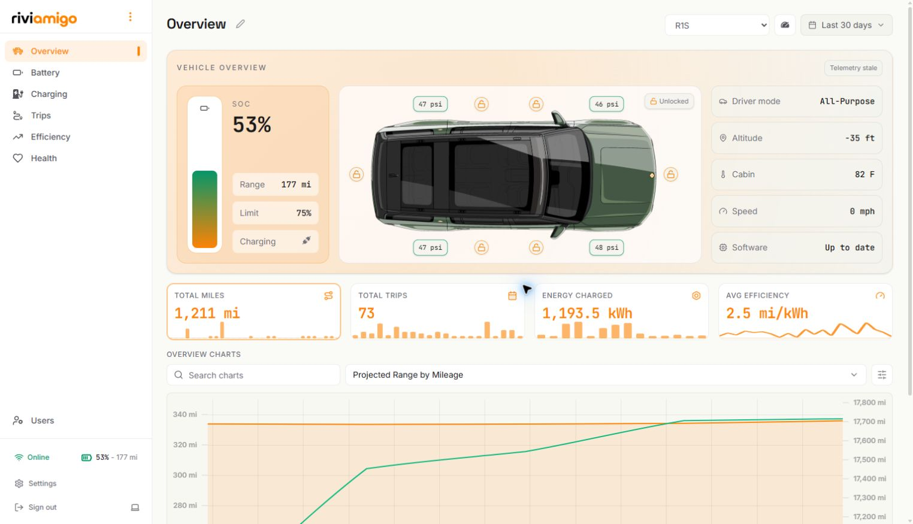
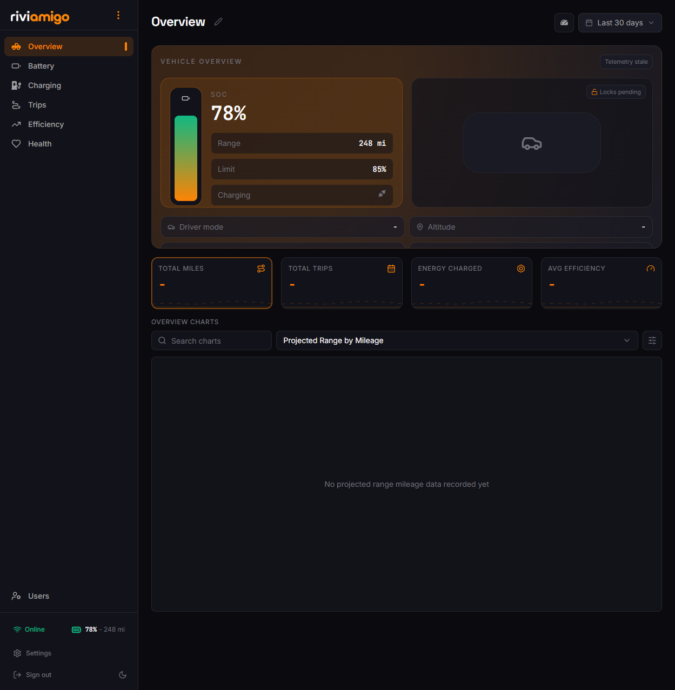
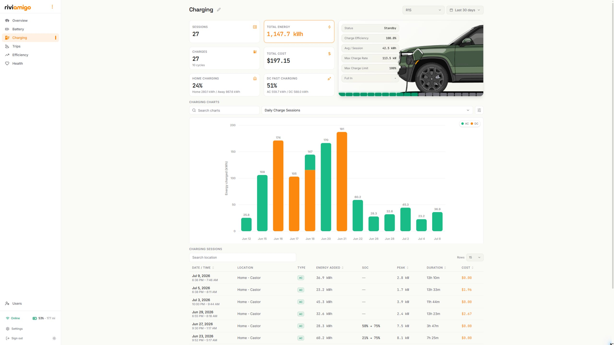
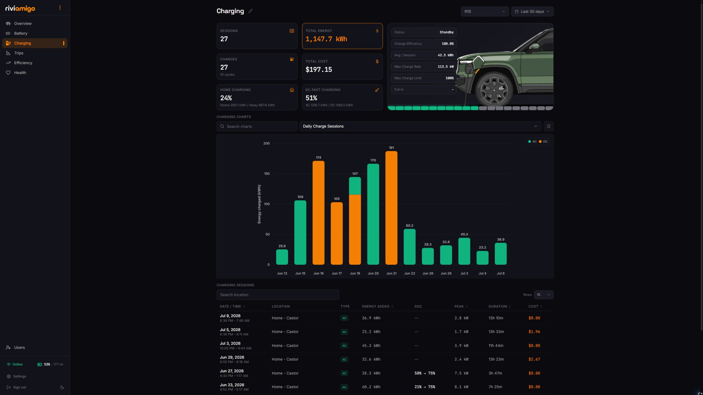
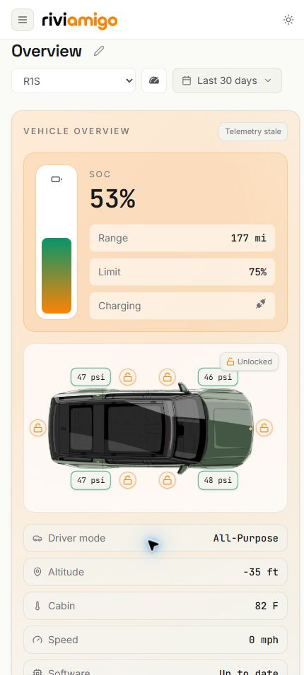
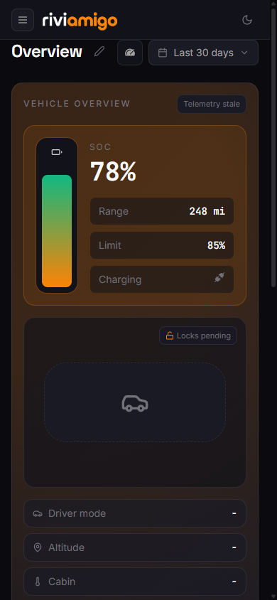
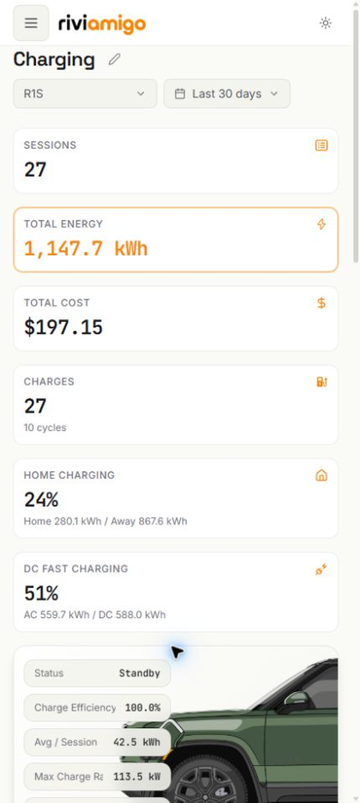
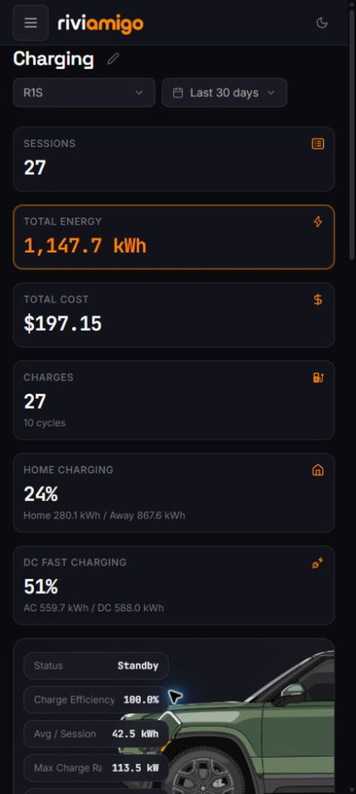

<p align="center">
  <picture>
    <source media="(prefers-color-scheme: dark)" srcset="./docs/assets/readme/logo-lockup-dark.png" />
    
  </picture>
</p>

<p align="center">
  <strong>Your Rivian's data companion.</strong><br />
  A private, self-hosted home for your vehicle's battery, charging, trips, and efficiency data.
</p>

Riviamigo connects to your Rivian account and turns its telemetry into a dashboard you can make your own. It runs on hardware you control—there is no Riviamigo-hosted account, subscription, or product analytics service in the middle.

> **Keep it private:** Riviamigo is for a trusted home network. If you need remote access, put it behind an authenticated tunnel or identity-aware reverse proxy; do not expose it directly to the internet. The [secure deployment guide](./docs/guides/secure-deployment.md) explains the boundary.

## A quick look

These are live, redacted views of Riviamigo at desktop and iPhone 17 Pro Max–style mobile sizes.

### Desktop

**Overview**

| Light | Dark |
| --- | --- |
|  |  |

**Charging**

| Light | Dark |
| --- | --- |
|  |  |

### Mobile

| Overview — light | Overview — dark | Charging — light | Charging — dark |
| --- | --- | --- | --- |
|  |  |  |  |

## What you can do here

- Check battery state, range, charging, health, trips, and efficiency at a glance.
- Keep historical vehicle data in your own stack instead of a third-party dashboard.
- Make dashboards fit the information you care about.
- Use the same responsive app from your desktop or phone.

## Set up your own stack

You only need a host that can run Docker Compose, Git, and a safe way to keep the instance private. Start with the [prerequisites](./docs/guides/prerequisites.md), then follow the [getting-started guide](./docs/guides/getting-started.md) for the small amount of production configuration Riviamigo needs.

Once your secrets and `.env` file are ready, bring up the self-hosted stack from the repository root:

```bash
docker compose --env-file .env -f compose/docker-compose.yml up -d
```

Open Riviamigo through your authenticated HTTPS address, create the first owner account, and connect your Rivian. The [deployment guide](./docs/guides/deployment.md) covers updates, logs, backups, and the gateway setup.

## Privacy

Riviamigo does not include product analytics, tracking pixels, or metrics sent to a Riviamigo-operated service. Your dashboard data stays in the database and backups you operate. It does make the external requests needed to talk to Rivian, and some optional map, weather, geocoding, or backup features may contact their respective providers. Read the [privacy details](./docs/privacy.md) before choosing where and how to host it.

## AI, review, and releases

We use AI coding tools as assistants—not as owners of a release. Contributors review and test AI-assisted changes before release, and the project’s CI includes dependency and secret checks, plus security auditing with `cargo audit`, `pnpm audit`, Gitleaks, Semgrep, and Trivy. CI is useful evidence, not a substitute for human review; see the [contributor guide](./docs/contributing.md) and [security audit](./docs/security-audit.md) for the full process.

## License

Riviamigo is licensed under [GPL-3.0-only](./LICENSE): you can use, modify, and share it, and distributed derivative work must remain open source under the same license. See the [GNU GPL v3](https://www.gnu.org/licenses/gpl-3.0.html) for the plain-language details.

## Developing Riviamigo

Want to contribute or run the developer stack? [`CLAUDE.md`](./CLAUDE.md) is the concise developer setup and command guide. The [docs hub](./docs/index.md) routes you to the architecture and contributor references.
